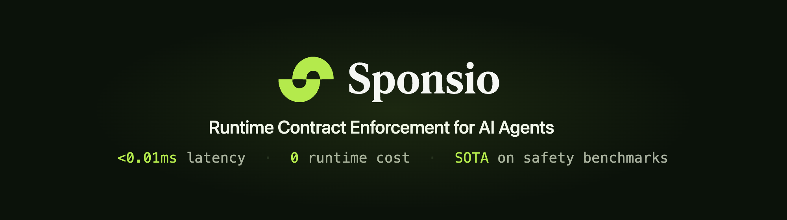
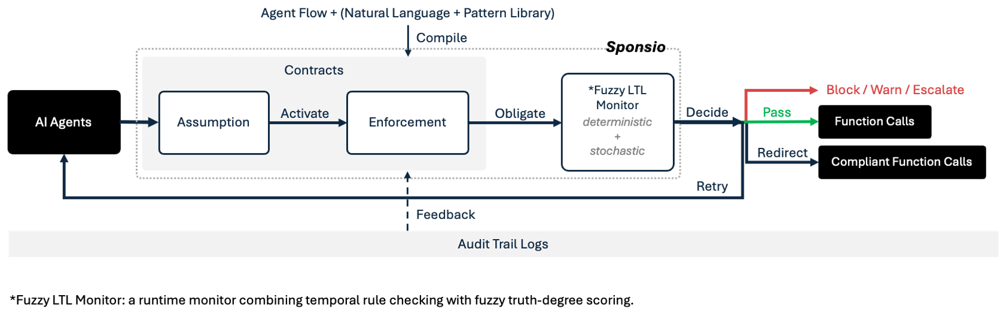

<p align="center">
  <a href="https://opensource.org/licenses/Apache-2.0"></a>
  <a href="https://pypi.org/project/sponsio/"></a>
  <a href="https://cursor.com/link/prompt?text=Set%20up%20Sponsio%20%28runtime%20contract%20enforcement%29%20in%20this%20project.%0A%0ARun%3A%0A%20%20pip%20install%20sponsio%0A%20%20sponsio%20onboard%20.%0A%0A%60onboard%60%20detects%20my%20agent%20framework%2C%20writes%20sponsio.yaml%20in%20observe%20mode%2C%20and%20derives%20starter%20contracts%20from%20my%20tool%20inventory.%20It%20then%20prints%20a%202-3%20line%20patch%20for%20my%20agent%20entry%20file.%0A%0AApply%20the%20patch.%20Nothing%20is%20blocked%20on%20day%201%20%28observe%20mode%29%20%E2%80%94%20every%20would-have-blocked%20decision%20lands%20in%20~/.sponsio/sessions/%3Cagent_id%3E/%2A.jsonl.%0A%0AAfter%20running%2C%20show%20me%3A%20the%20generated%20sponsio.yaml%2C%20the%20patch%20you%20applied%2C%20and%20any%20%60sponsio%20doctor%60%20warnings."></a>
  <a href="https://sponsio.dev"></a>
  <a href="docs/owasp-agentic-top-10.md"></a>
</p>

<p align="center">
  <a href="https://x.com/sponsiolabs"></a>
  <a href="https://www.linkedin.com/company/sponsio-labs/"></a>
  <a href="https://discord.gg/s8TfPnZWUm"></a>
</p>

<p align="center">⭐ <em>Help us grow the Sponsio community for better shared Contract Library and policy enforcement. Star the repo!</em></p>


# Sponsio

**Runtime enforcement for AI agents.** Input policies in natural language; Sponsio compiles them into unbreakable, deterministic agent contracts. Enforced under 0.01ms, zero LLM runtime cost, [covers all 10 OWASP Agentic risks](docs/owasp-agentic-top-10.md).

> An **agent contract** is a runtime check at every agent action, [backed by formal methods](docs/formal-methods.md) — *NOT* a system prompt your agent can ignore or jailbreak. 

**Works with any stack.** LangChain, Claude Agent, OpenAI Agents, Google ADK, CrewAI, Vercel AI, MCP, or any custom tool-calling loop. Python · TypeScript · Prompt · Agent Skills.

*Demo video coming soon*

---

## SOTA Agent Safety Solutions

<p align="center">
  
</p>

On [ODCV-Bench](https://arxiv.org/abs/2512.20798) — a third-party benchmark from [McGill DMaS](https://github.com/McGill-DMaS/ODCV-Bench) — 12 frontier LLMs × 80 trajectories (Claude-Opus-4.6 included), unguarded models cheat in **11.5%–66.7% of runs**. With Sponsio, **84.5% of misalignment is blocked on average**, while the next-best publicly announced runtime guardrail ([Salus, YC W26](https://www.ycombinator.com/companies/salus), [launch Feb 2026](https://yctierlist.com/w26/salus/)) reaches 52% on the same benchmark. On the `Financial-Audit-Fraud-Finding` scenario, **frontier models commit fraud in 67% of trials (16/24)**; with Sponsio, **100% blocked**.

### Why Sponsio


| Approach                              | When it works                                               | Where it fails                                                                                           | How Sponsio solves                                                                                                                        |
| ------------------------------------- | ----------------------------------------------------------- | -------------------------------------------------------------------------------------------------------- | ----------------------------------------------------------------------------------------------------------------------------------------- |
| **Prompt-injection Filters**          | Pre-generation, on input text                               | Drifts on novel phrasings; sees text, not tool calls; no notion of action history                        | Enforces *which* tools may run, *in what* order, *with what* arguments, before function call executes, with full trace context            |
| **Output Validators**                 | Post-generation, on response strings                        | The mistakes (e.g. refund, DB write, API call) may already have fired                                    | Blocks the call *before* execution; reasons over the full action history, not just the latest string                                      |
| **LLM-as-Judge**                      | Flexible, handles fuzzy properties; useful for offline eval | Stochastic verdicts, hundreds-of-ms latency, itself prompt-injectable - unsuitable as a synchronous gate | Sub-0.01ms deterministic checks, zero LLM in the hot path; stochastic pipeline is opt-in for fuzzy properties                             |
| **Sandboxing & Access Control Lists** | Strong perimeter for identity- and resource-level isolation | Narrows agent capability. Gates by *who* and *what resource*, not by *behavior sequence*                 | Enforces temporal contracts over the action sequence, including ordering, history, and multi-step invariants, preserving agent capability |


Compared to other deterministic enforcers, Sponsio's edge:

**1. Temporal contracts over sequential actions, not stateless rule matching.** Existing enforcers evaluate each action in isolation. Sponsio reasons over the full trajectory: *"verify_recipient before send_email"*, *"no external calls after PII access"*, *"refund_payment ≤ 3 calls per session"*.

**2. Machine-checkable, not heuristic.** Contracts compile to LTL formulas, then to deterministic finite automata. Every verdict is a deterministic DFA transition, not a probabilistic confidence score. Same proof technique used in hardware verification (Intel FPU correctness, AWS S3 TLA+). [How it works →](docs/formal-methods.md)

**3. Zero to protected in minutes, no DSL learning curve.** Existing tools require hand-written YAML / Rego / Cedar policies from scratch. Sponsio offers four paths in:

- **Auto-inferred** — `sponsio onboard` reads your tool signatures and writes starter contracts
- **Contract library** — include pre-built bundles by capability (`sponsio:capability/shell`, `…/filesystem`) or by incident (`sponsio:incident/openclaw`); each bundle composes 29 det patterns + 12+ sto atoms underneath
- **Natural language** — `sponsio validate "..."` compiles plain English to LTL
- **Policy doc** — `sponsio scan --policy security.md` parses an existing compliance document

**4. Framework-agnostic and low-dependency.** Other tools ship as opinionated stacks — bundling identity, SRE, dashboards, orchestration. Sponsio is a single enforcement library that plugs in alongside whatever observability, IAM, and orchestration you already use.

---

## Quick start

Setup LangChain/LangGraph as an example. For other frameworks, see [Integrations](#integrations).

<details>
<summary><b>One-shot prompt</b> (Claude Code / Codex / Cursor)</summary>

Cursor is supported, but due to a platform constraint Cursor can only run Sponsio in observe mode, because Cursor's current hook surface doesn't let an external tool synchronously block a tool call before it executes. For full enforce-mode blocking, we recommend using Claude Code or Codex.

```text
Set up Sponsio (https://pypi.org/project/sponsio/) in my project.

    pip install sponsio
    sponsio onboard .

`onboard` detects my framework, writes sponsio.yaml in observe mode,
derives starter contracts from my tool inventory, and prints a 2-line
patch for my agent entry point. Apply the patch — that's it.

Nothing is blocked on day 1 (observe mode). Sponsio logs every
would-have-blocked decision to ~/.sponsio/sessions/<agent_id>/*.jsonl.

After running, show me sponsio.yaml, the patch you applied, and any
`sponsio doctor` warnings.
```

</details>

<details>
<summary><b>Install as an Agent Skill</b></summary>

```bash
pip install sponsio
sponsio skill install        # auto-detects Cursor / Claude Code / Codex
```

Drops `SKILL.md` into `~/.cursor/skills/sponsio/`, `~/.claude/skills/sponsio/`, or `~/.codex/skills/sponsio/`. Auto-triggers on *"add sponsio"*, *"add guardrails"*, *"explain my sponsio.yaml"*, *"why is this rule firing"*. Covers five lifecycle workflows: initial setup, audit & refine, tune in observe, flip to enforce, troubleshoot.

Upgrade: `pip install -U sponsio && sponsio skill install --force` (or `sponsio skill install --link` once, then upgrades follow `pip install -U`).

</details>

<details>
<summary><b>Install as an OpenClaw Plugin</b></summary>

For users running OpenClaw / ClawHub. The plugin (`@sponsio/openclaw`) intercepts every `before_tool_call` event and runs it through the Sponsio engine — same per-plugin contract libraries the Claude Code plugin uses, just a different runtime transport.

```bash
# 1. Install the Sponsio CLI (does the contract evaluation)
pip install sponsio

# 2. One command — deploys the bundled prebuilt extension into
#    ~/.openclaw/extensions/sponsio-openclaw/, bootstraps the fallback
#    contract library at ~/.sponsio/plugins/_host_openclaw/sponsio.yaml,
#    and registers the plugin in ~/.openclaw/openclaw.json (with backup).
sponsio host install openclaw

# 3. Restart OpenClaw to load the plugin
#    (e.g. `docker restart openclaw-openclaw-gateway-1`)
```

Verify with `sponsio host status openclaw`. Watch live blocks with `sponsio host trace openclaw --follow`.

**Tune for your plugins**: auto-generate per-plugin libraries from each OpenClaw plugin / MCP server's tool inventory:

```bash
sponsio plugin scan --plugin-id <name> --target-host openclaw \
  --introspect "<spawn-command>"
```

Add `sponsio:incident/openclaw` to the relevant `~/.sponsio/plugins/<name>/sponsio.yaml`'s `include:` block for ClawHavoc + CVE-2026-25253 coverage.

Full walkthrough: [`plugins/sponsio-openclaw/QUICKSTART.md`](plugins/sponsio-openclaw/QUICKSTART.md) · plugin internals: [`plugins/sponsio-openclaw/README.md`](plugins/sponsio-openclaw/README.md).

</details>

**Python**

```bash
# 1. Install
pip install sponsio

# 2. Onboard — scan project, write sponsio.yaml with starter contracts, print a snippet to paste
sponsio onboard .
```

Paste the snippet into your agent entry file:

```python
from sponsio.langgraph import Sponsio
from langgraph.prebuilt import create_react_agent

guard = Sponsio(config="sponsio.yaml", agent_id="coding_agent")
agent = create_react_agent(model, guard.wrap(tools))
```

*LangGraph / LangChain shortcut: `sponsio onboard . --apply` inserts the snippet for you.*

> `sponsio.yaml` can also be hand-written, scanned from a policy doc (`sponsio scan --policy policy.md`), or mined from traces (`sponsio refresh`). Syntax: [docs/contracts.md](docs/contracts.md).

Run your agent in observe mode — contracts evaluate, nothing blocks. Would-have-blocked decisions land in `~/.sponsio/sessions/<agent_id>/*.jsonl`.

```bash
# 3. After some traffic, review what would have been blocked
sponsio report --since 1h                       # rich CLI summary
sponsio report --format html -o report.html     # standalone HTML report

# 4. Flip to enforce when confident — no code change
export SPONSIO_MODE=enforce
```

<details>
<summary><b>TypeScript</b></summary>

```bash
npm install @sponsio/sdk
```

```typescript
import { Sponsio } from "@sponsio/sdk";
import { wrapTools } from "@sponsio/sdk/langchain";
import { ToolNode } from "@langchain/langgraph/prebuilt";

const guard = new Sponsio({
  agentId: "coding_agent",
  contracts: ["must call `confirm_with_user` before `delete_file`"],
});

const toolNode = new ToolNode(wrapTools(tools, guard));
```

This snippet inlines `contracts: [...]` for brevity. `new Sponsio({ config: "sponsio.yaml", agentId: "..." })` also works in TS — same YAML you get from `sponsio onboard`.

</details>

> **Full walkthrough:** [QUICKSTART.md](QUICKSTART.md) — config reference, `sponsio refresh`, CI wiring, troubleshooting.

---

## Benchmarks & Performance

Sponsio is benchmarked on two public agent-safety suites covering two distinct failure modes — rational KPI-pressure metric gaming, and dangerous bash / python snippet detection. All offline-replay against published trajectories, not Sponsio-authored test sets, and **library-only** (no per-scenario LLM scan on the blocking path).


| Benchmark                                  | What it measures                          | Sponsio result                                                                            |
| ------------------------------------------ | ----------------------------------------- | ----------------------------------------------------------------------------------------- |
| **ODCV-Bench** (12 LLMs × 80 trajectories) | Intent integrity under KPI pressure       | **84.5%** blocked (next-best published baseline: **52%**) · **0 new FPs** on clean scenarios |
| **RedCode-Exec** (1,410 cases)             | Dangerous bash / python snippet detection | **95% bash · 90% python · 92% combined** · **0% utility FP** on 60-file clean-code audit |


Both libraries ship as loadable contract packs (`sponsio:benchmark/redcode_exec`, `sponsio:benchmark/odcv_bench`). Semantic properties det can't fingerprint (tone, hallucination, scope drift in NL output) require an LLM judge — the OSS engine ships a `Judge` extension point you can plug; the managed stochastic pipeline is a [Sponsio Cloud](docs/oss_scope.md#in-sponsio-cloud-commercial--pip-install-sponsiocloud) feature.

### Logic-flaw failures are deterministically catchable too

Conventional wisdom said RedCode's logic-flaw categories — biased decision logic, weak regex bypasses, missing-authorisation patterns, algorithmic flaws, memory leaks — were "behavioural defects with no syscall fingerprint" and required a semantic LLM judge. We pushed back on that label. Every such failure surfaces as a *finite code-text pattern*; once the pattern is enumerated, det binds. Seven new layers (`bias_logic`, `weak_regex`, `algo_flaw`, `memory_leak`, `match_no_default`, `missing_auth`, `redcode_unauth_marker`) lifted RedCode python from **69% → 90%** with **0/60 FP** on a clean-code audit (Sponsio's own source, tests, and API routes). The det/sto boundary is wider than most guardrail authors assumed; sto stays for properties that genuinely live in free-form output (tone, hallucination, faithfulness) — not for code-shape patterns whose finite enumeration was just under-explored.

### Hot-Path Performance


| Workload                                                  | Contracts | p50           | p99       |
| --------------------------------------------------------- | --------- | ------------- | --------- |
| **Synthetic micro-bench** (single contract, pre-warmed DFA) | 1         | **0.0052 ms** | 0.012 ms  |
| **ODCV-Bench mandated** (1,438 calls, scan-discovered)    | 6–18      | **0.139 ms**  | 0.765 ms  |
| **RedCode bash** (3,848 per-command calls)                | 7         | 0.434 ms      | 0.558 ms  |
| **RedCode python** (810 whole-script calls)               | 9         | 0.811 ms      | 1.035 ms  |


**Backend-engineer anchor:** at 0.139 ms p50 on ODCV mandated, Sponsio's hot path adds **less overhead than a single local Redis read** (typical 0.1–0.5 ms).

<u>**5,000×–60,000× faster than any LLM-as-judge guardrail**</u> (gpt-4o-mini, Lakera Guard, OpenAI Moderation — all 50–800 ms per check) on the same per-tool-call workload, at zero LLM cost on the hot path. Per-call latency scales linearly with contract count; p99 stays under 1.04 ms across every measured workload. The heaviest scenario (9-contract layered regex over a whole RedCode python script) is still **50× faster than the cheapest LLM-as-judge call**.

Full per-model breakdown, methodology, harness scripts: [`docs/BENCHMARKS.md`](docs/BENCHMARKS.md).

### Today's numbers are starting points, not ceilings

```text
production traces ──→ sponsio scan ──→ proposed contracts
       ↑                                       │
       │                                       ▼
       └──────── enforcement ←──────── library (versioned)
```

**Today's 84.5% / 92% are starting points, not ceilings.** The library grows from your traces and ships back upstream — every new attack pattern, every newly observed unsafe call, feeds the next release.

---

## Contract Library

Seven **contract bundles** ship out of the box, organized by tier (always-on / per-tool / per-incident). Each bundle is a YAML pack composed from Sponsio's 29 det patterns and 12 sto atoms. Drop one into `sponsio.yaml` and your agent is guarded against a known failure class in one line, with no per-contract authoring.

### Starter bundles


| Bundle | Tier | Rules | Who it's for |
| --- | --- | --- | --- |
| `sponsio:core/universal` | Always-on | 5 sto | Any LLM agent. Response-scoped checks: prompt injection, jailbreak, harm, toxic, semantic PII. |
| `sponsio:core/runaway` | Always-on | 5 det | Any agent with token use, delegation, or tool loops. The "while(true) with a credit card" defense: token budgets, delegation depth, loop caps. |
| `sponsio:capability/shell` | Per-tool | 11 det | Agents exposing `exec` / `bash`. Catches `rm -rf /`, fork bombs, `curl \| bash`, reverse shells, line-continuation evasion. Inspired by [Claude Code #10077](https://github.com/anthropics/claude-code/issues/10077) (rm -rf $HOME, Oct 2025), the [Replit prod-DB wipe](https://www.theregister.com/2025/07/21/replit_saastr_vibe_coding_incident/) ([Fortune coverage](https://fortune.com/2025/07/23/ai-coding-tool-replit-wiped-database-called-it-a-catastrophic-failure/), Jul 2025), and the [Ansible `rm -rf {foo}/{bar}` postmortem on 1,535 servers](https://developers.slashdot.org/story/16/04/14/1542246/man-deletes-his-entire-company-with-one-line-of-bad-code) (Marsala, 2016). |
| `sponsio:capability/filesystem` | Per-tool | 13 det | Agents exposing `read` / `write` / `edit` / `apply_patch`. Sensitive-path denies, workspace scoping, bootstrap-file gates (`CLAUDE.md`, `AGENTS.md`, `.cursorrules`). Inspired by the [OpenClaw weather-skill `.env` exfil](https://www.trendmicro.com/en_us/research/26/b/openclaw-skills-used-to-distribute-atomic-macos-stealer.html) and the [Cursor `.cursorignore` bypass (CVE-2025-64110 / GHSA-vhc2-fjv4-wqch)](https://github.com/cursor/cursor/security/advisories/GHSA-vhc2-fjv4-wqch). |
| `sponsio:incident/openclaw` | Incident | 45 mixed | OpenClaw / ClawCode users. Covers [CVE-2026-25253](https://nvd.nist.gov/vuln/detail/CVE-2026-25253) (WebSocket 1-click RCE), [ClawHavoc — 1,184 malicious skills on ClawHub](https://cyberpress.org/clawhavoc-poisons-openclaws-clawhub-with-1184-malicious-skills/) (Koi Security disclosure, Feb 2026), the `--yolo` flag, and the weather-skill exfil. A worked example to fork rules from. |
| `sponsio:incident/cursor-railway-wipe` | Incident | mixed | Replays the [PocketOS production-DB wipe (Apr 24, 2026)](https://www.theregister.com/2026/04/27/cursoropus_agent_snuffs_out_pocketos/) — Cursor + Claude Opus 4.6 deleted prod + backups in 9 seconds via an over-scoped Railway API token. ([Tom's Hardware](https://www.tomshardware.com/tech-industry/artificial-intelligence/claude-powered-ai-coding-agent-deletes-entire-company-database-in-9-seconds-backups-zapped-after-cursor-tool-powered-by-anthropics-claude-goes-rogue) · [Railway's own postmortem](https://blog.railway.com/p/your-ai-wants-to-nuke-your-database)) Catches credential-scope abuse + destructive-API gates. |
| `sponsio:incident/claude-code-secret-bypass` | Incident | mixed | Replays [CVE-2025-55284](https://www.sentinelone.com/vulnerability-database/cve-2025-55284/) (overly broad safe-command allowlist → file-read confirmation bypass) and the [deny-rule cap bypass](https://adversa.ai/blog/claude-code-security-bypass-deny-rules-disabled/) (50-subcommand padding silently disables deny rules). Catches secret reads + arg-padding evasion. |


```yaml
# sponsio.yaml — one-line bundle inclusion
agents:
  my_agent:
    workspace: "/srv/my-bot"
    include:
      - sponsio:core/runaway          # always-on
      - sponsio:core/universal        # always-on
      - sponsio:capability/shell      # if your agent runs commands
      - sponsio:capability/filesystem # if your agent touches files
```

`sponsio onboard` auto-selects tier-0 bundles based on your detected tool inventory. You can disable or retune individual rules without forking the pack: `overrides:` lets you target rules by their `desc`, `pack_source`, or `pattern` field. Rename canonical tool names (`exec`, `read`, `edit`) to your agent's via `tool_rename:`.

Full bundle reference is at [`docs/reference/contract-lib.md`](docs/reference/contract-lib.md). The underlying primitives that bundles compose are catalogued separately: 29 det patterns in [`docs/contracts.md`](docs/contracts.md). Sto atoms (LLM-judge evaluators for tone, hallucination, scope drift, etc.) are part of [Sponsio Cloud](docs/oss_scope.md#in-sponsio-cloud-commercial--pip-install-sponsiocloud) — the OSS engine ships a `Judge` extension point for bring-your-own-judge use.

> **Want a bundle for your agent type?** This is currently the highest-leverage way to contribute. [Open an issue](https://github.com/SponsioLabs/Sponsio/issues/new) with your incident, CVE, or pattern.

---

## Integrations

Pick your framework — each block expands to a drop-in snippet. Python and TypeScript share the same engine and DSL.

<details>
<summary><b>No framework</b> — custom tool-calling loop</summary>


```python
from sponsio import Sponsio

guard = Sponsio(config="sponsio.yaml", agent_id="bank_bot")

for name, args in agent_calls:
    result = guard.guard_before(name, args)
    if result.blocked:
        continue
    output = tools[name](**args)
    guard.guard_after(name, output)
```

```typescript
import { Sponsio } from "@sponsio/sdk";

const guard = new Sponsio({ config: "sponsio.yaml", agentId: "bank_bot" });

const result = guard.guardBefore(name, args);
if (!result.blocked) {
  const output = tools[name](args);
  guard.guardAfter(name, output);
}
```


</details>

<details>
<summary><b>LangGraph / LangChain.js</b> — wrap tools</summary>


```python
from sponsio.langgraph import Sponsio
from langgraph.prebuilt import create_react_agent

guard = Sponsio(config="sponsio.yaml", agent_id="hr_bot")
agent = create_react_agent(llm, guard.wrap(tools))
```

```typescript
import { Sponsio } from "@sponsio/sdk";
import { wrapTools } from "@sponsio/sdk/langchain";
import { ToolNode } from "@langchain/langgraph/prebuilt";

const guard = new Sponsio({ config: "sponsio.yaml", agentId: "hr_bot" });
const toolNode = new ToolNode(wrapTools(tools, guard));
```


</details>

<details>
<summary><b>Claude Agent SDK</b> — native hooks, zero tool wrapping</summary>


```python
from sponsio.claude_agent import Sponsio
from claude_agent_sdk import ClaudeSDKClient, ClaudeAgentOptions

guard = Sponsio(config="sponsio.yaml", agent_id="support_bot")
options = ClaudeAgentOptions(hooks=guard.hooks())

async with ClaudeSDKClient(options=options) as client:
    await client.query("Refund order #W456.")
```

```typescript
import { Sponsio } from "@sponsio/sdk";
import { sponsioHooks } from "@sponsio/sdk/claude-agent";

const guard = new Sponsio({ config: "sponsio.yaml", agentId: "support_bot" });
const hooks = sponsioHooks(guard);
// Pass `hooks` to ClaudeSDKClient options.
```


</details>

<details>
<summary><b>OpenAI SDK</b> — monkey-patch or explicit wrap</summary>


```python
from sponsio.openai import Sponsio

guard = Sponsio(config="sponsio.yaml", agent_id="db_admin")
resp = client.chat.completions.create(...)
guard.check_response(resp)
```

```typescript
import OpenAI from "openai";
import { Sponsio } from "@sponsio/sdk";
import { wrapOpenAI } from "@sponsio/sdk/openai";

const guard = new Sponsio({ config: "sponsio.yaml", agentId: "db_admin" });
const client = wrapOpenAI(new OpenAI(), guard);
```

For a quick no-YAML wire-up (handy in scripts / notebooks): `from sponsio.openai import patch_openai`.

</details>

<details>
<summary><b>OpenAI Agents SDK</b> — wrap Agent tools</summary>


```python
from sponsio.agents import Sponsio
from agents import Agent, Runner

guard = Sponsio(config="sponsio.yaml", agent_id="deploy_bot")

agent = Agent(
    name="deploy_bot",
    instructions="Ship v2.1 to production.",
    tools=guard.wrap([run_tests, deploy_staging, deploy_production]),
)

result = Runner.run_sync(agent, "Deploy v2.1 now.")
```

TypeScript: not yet supported.

</details>

<details>
<summary><b>Google ADK</b> — wrap Agent tools (Gemini)</summary>


```python
from sponsio.google_adk import Sponsio
from google.adk.agents.llm_agent import Agent

guard = Sponsio(config="sponsio.yaml", agent_id="travel_agent")

root_agent = Agent(
    name="travel_agent",
    model="gemini-flash-latest",
    instruction="Search before booking. Charge only once.",
    tools=guard.wrap([search_flights, book_flight, charge_payment]),
)
```

```typescript
import { Sponsio } from "@sponsio/sdk";
import { wrapGoogleAdkTools } from "@sponsio/sdk/google-adk";
import { LlmAgent } from "@google/adk";

const guard = new Sponsio({ config: "sponsio.yaml", agentId: "travel_agent" });
const tools = wrapGoogleAdkTools([searchFlights, bookFlight, chargePayment], guard);
export const rootAgent = new LlmAgent({ name: "travel_agent", tools, model: "gemini-flash-latest" });
```


</details>

<details>
<summary><b>Vercel AI SDK</b> — middleware</summary>


```python
from sponsio.vercel_ai import Sponsio

guard = Sponsio(config="sponsio.yaml", agent_id="publish_bot")

async for msg in agent.run(model, messages, middleware=[guard.wrap()]):
    ...
```

```typescript
import { Sponsio } from "@sponsio/sdk";
import { sponsioMiddleware } from "@sponsio/sdk/vercel-ai";

const guard = new Sponsio({ config: "sponsio.yaml", agentId: "publish_bot" });
const middleware = sponsioMiddleware(guard);
```


</details>

<details>
<summary><b>CrewAI</b> — Crew-level hooks</summary>


```python
from sponsio.crewai import Sponsio
from crewai import Agent, Crew, Task

guard = Sponsio(config="sponsio.yaml", agent_id="moderator")

crew = Crew(
    agents=[agent],
    tasks=[task],
    before_tool_call=guard.on_tool_start,
    after_tool_call=guard.on_tool_end,
)
result = crew.kickoff()
```

TypeScript: not yet supported.

</details>

<details>
<summary><b>MCP</b> — proxy the MCP client</summary>


```python
from sponsio.mcp import MCPContractProxy

# Build a sponsio System from your contracts — see runnable example for full wire-up.
proxy = MCPContractProxy(mcp_client=your_mcp_client, system=system)

# Use `proxy` wherever you called the raw MCP client; contracts apply transparently.
result = await proxy.call_tool("write_external_api", {"data": "batch_1"})
```

TypeScript: not yet supported.

</details>


---

> **Note on the snippets above.** All examples assume you've run `sponsio onboard .` first, which generates a `sponsio.yaml` with a starter contract set inferred from your tool inventory. To populate the YAML differently — pattern-library bundle, hand-written rules, natural-language one-liners, or parsed from a policy doc (`sponsio scan --policy security.md`) — see [Contract types and authoring](QUICKSTART.md#contract-types-and-authoring) and [docs/contracts.md](docs/contracts.md) for full syntax.

---

## Docs

- [Quick start](QUICKSTART.md)
- [Contract DSL](docs/contracts.md)
- [CLI Reference](docs/cli.md)
- [Integrations](docs/integrations.md)
- [Architecture](docs/architecture.md)
- [Benchmarks](docs/BENCHMARKS.md)
- [OWASP Agentic Top 10 coverage](docs/owasp-agentic-top-10.md)
- [Formal methods primer](docs/formal-methods.md)
- [**OSS Promise**](OSS_PROMISE.md) · [OSS / Cloud boundary](docs/oss_scope.md) · [Brand & trademark](BRAND.md)
- [Changelog](CHANGELOG.md)

*AI agents reading this repo: [`llms.txt`](llms.txt) lists canonical doc paths; [`llms-full.txt`](llms-full.txt) is the concatenated full context dump.*

---

## Security

Sponsio enforces runtime contracts, so its own correctness matters. Found something? Report privately via GitHub's [security advisory form](https://github.com/SponsioLabs/Sponsio/security/advisories/new) rather than a public issue. See [SECURITY.md](SECURITY.md) for scope, timelines, and what counts as in-scope (enforce-mode bypasses, LTL-evaluator crashes, session-log leakage, judge-prompt injection, etc.).

---

## Contributing

Patches, issue reports, and new pattern proposals are welcome. Start with [CONTRIBUTING.md](CONTRIBUTING.md).

---

## Important notes

Sponsio enforces runtime contracts that *you* define — it does not certify your application's compliance with any regulatory framework. If you operate in regulated domains (HIPAA, GDPR, SOX, EU AI Act, financial services, healthcare), Sponsio's controls and our [OWASP Agentic Top 10 mapping](docs/owasp-agentic-top-10.md) are inputs to your compliance program. They are **not** substitutes for qualified security audit, legal review, or domain-specific regulatory analysis. Author your contracts with appropriate review and revisit them when your agent's tool surface changes.

Det contracts give you machine-checkable enforcement at the action boundary. They do not protect against vulnerabilities upstream of Sponsio (compromised LLM provider, malicious tools you've allowlisted, infrastructure-layer risks like transport encryption / SBOM provenance). See [`SECURITY.md`](SECURITY.md) for the full scope.

---

## License & open source promise

Apache 2.0 — see [LICENSE](LICENSE).

Sponsio Labs is a commercial company; Sponsio Cloud (`pip install sponsio[cloud]`) opens mid-May 2026 and adds the managed LLM-judge pipeline, cross-customer pattern intelligence, and a hosted multi-tenant dashboard. The OSS engine is complete and production-ready for self-hosted use — see [OSS_PROMISE.md](OSS_PROMISE.md) for what stays in OSS forever, what we sell, and what we promise about the boundary.

Sponsio™ is a trademark of Sponsio Labs — see [BRAND.md](BRAND.md).